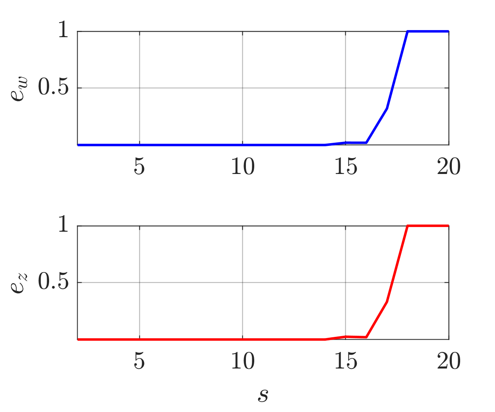
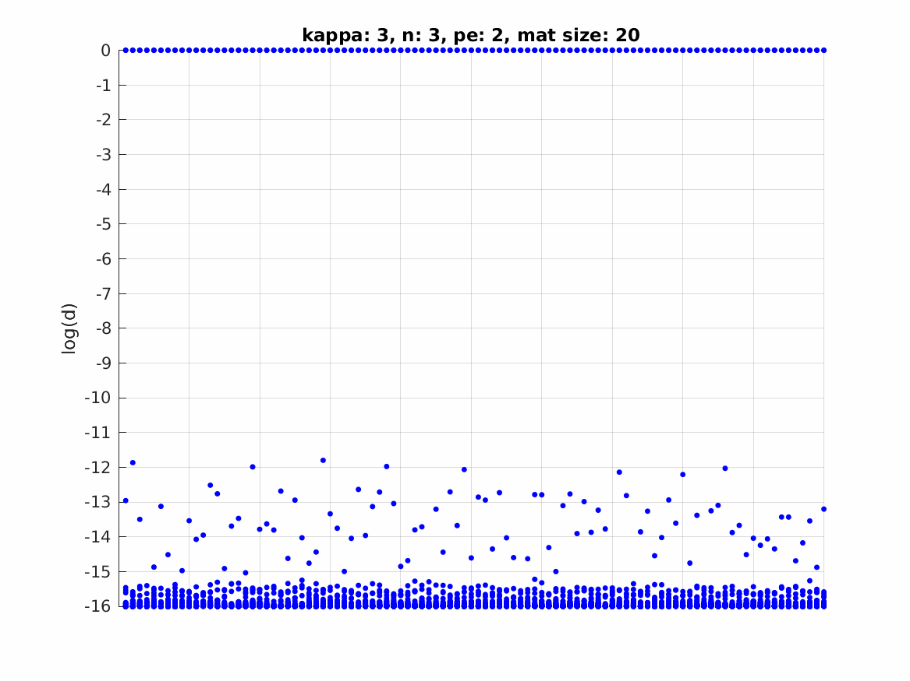
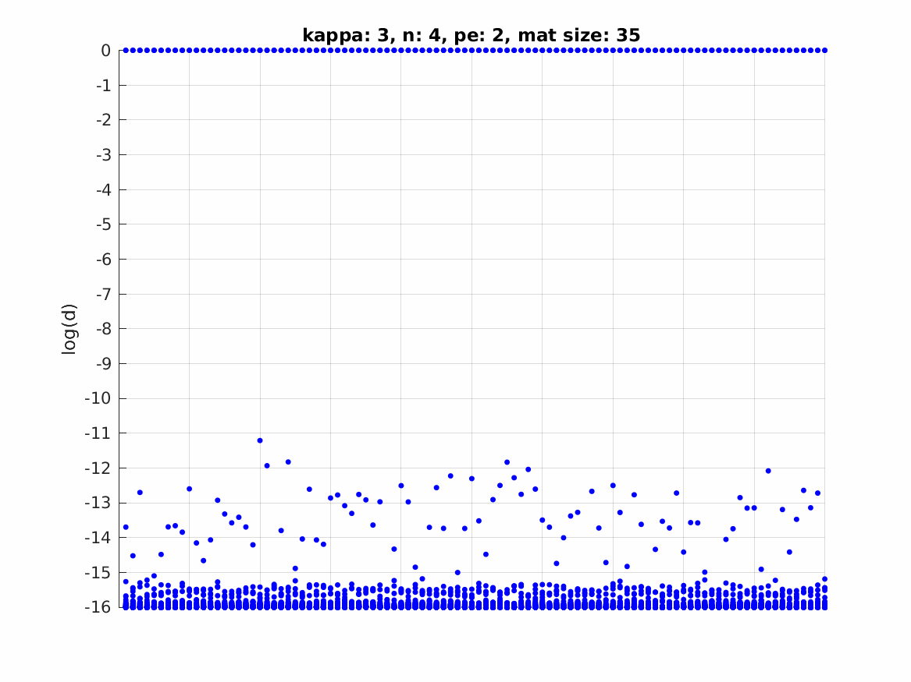
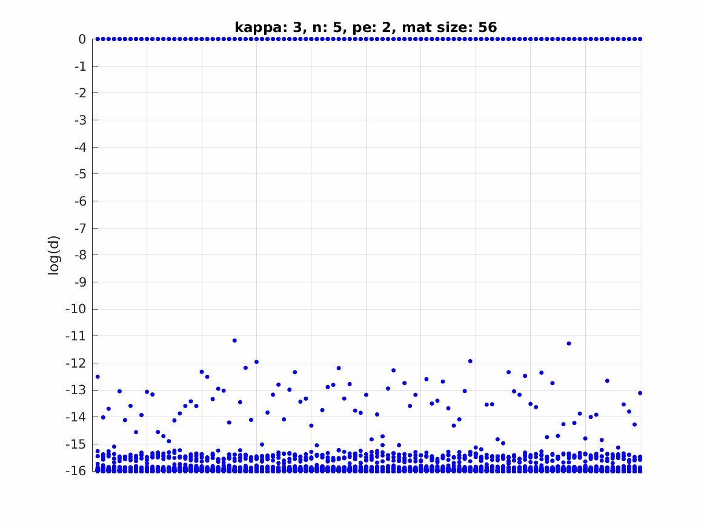
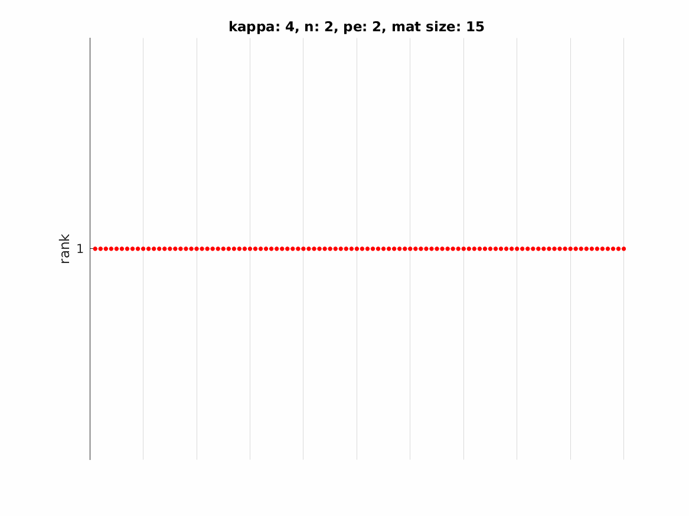
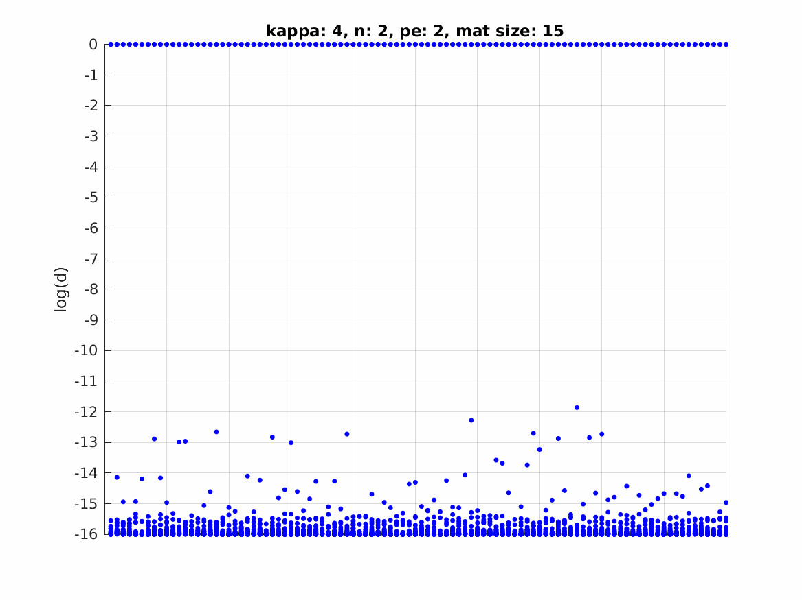
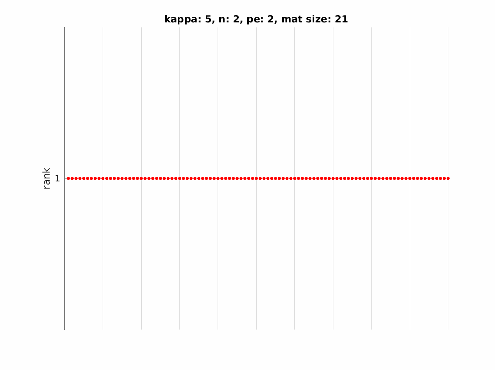
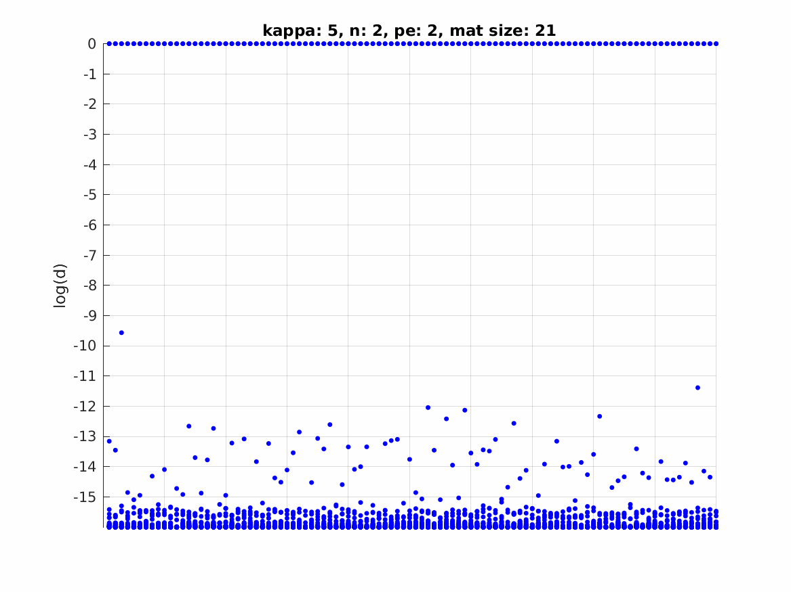

# Moment Cone Properties

## d = 2, n = 3

  
  
  <!--  -->

## d = 2, n = 4

  
  
  <!--  -->

## d = 2, n = 5

  
  
  <!--  -->

## d = 2, n = 6

  
  
  <!--  -->

## d = 2, n = 7

  
  
  <!--  -->

## d = 2, n = 8

  
  
  <!--  -->

## d = 2, n = 9

  
  
  <!--  -->

## d = 2, n = 10

  
  
  <!--  -->

<!-- ## d = 3, n = 3

  
  
  

## d = 3, n = 4

  
  
  

## d = 3, n = 5

  
  
  

## d = 4, n = 2

  
  
  

## d = 5, n = 2

  
  
  

 -->
