# Codebase for **Simplicial Regularizability of Pseudo-Moment Cone**

## Setup

Before running the scripts in this repository:

1. Pre-install dependencies in MATLAB:
  - Mosek for MATLAB: https://www.mosek.com/downloads/
  - msspoly (via SPOTless): https://github.com/spot-toolbox/spotless
2. Precompile the `sos_sdp_conversion` package by running `sparse_sdp_relax_install.m` in MATLAB.
3. If installation of `sos_sdp_conversion` fails, set `if_sos_sdp_conversion = false` in the scripts, and the code will automatically load pre-generated moment cone data from the `constraint` folder.
  Affected scripts: `test_point_evaluation.m`, `test_verify_extremity.m`, `main_phase_transition.m`.

## Quick Usage

1. For the simplest usage, run `test_point_evaluation.m`.
  In this script:
  - `n` is the variable number $n$ in the paper.
  - `kappa` is the relaxation order $d$ in the paper.
  - `point_evaluation_num` is $s$ in the paper.
2. To reproduce the paper's phase-transition results, run `main_phase_transition.m`.
  Warning: this experiment may take a very long time.
3. `test_verify_extremity.m` help to verify the extremity of an element in a spectrahedral cone.
4. `recover_phase_transition.m` plots $e_w$ and $e_z$ in the paper. 
5. 4. `plot_phase_transition.m` plots scatters in the paper. 

## Moment Cone Properties

### $d = 2, n = 3$

  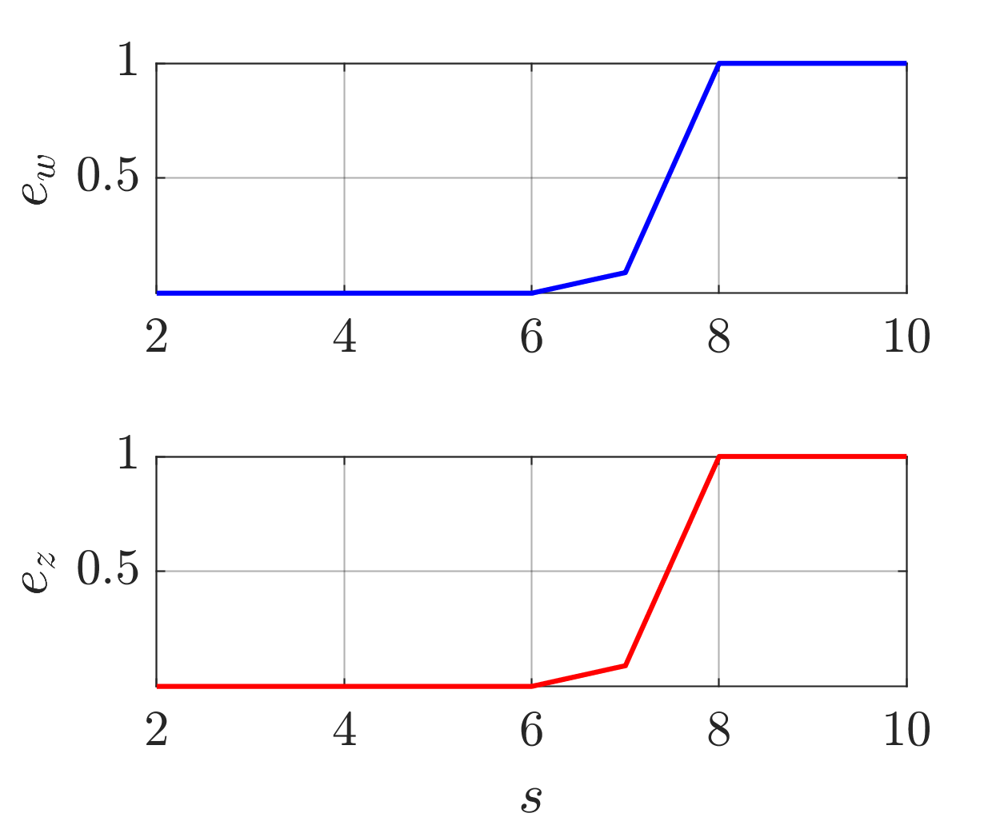
  
  <!--  -->

### $d = 2, n = 4$

  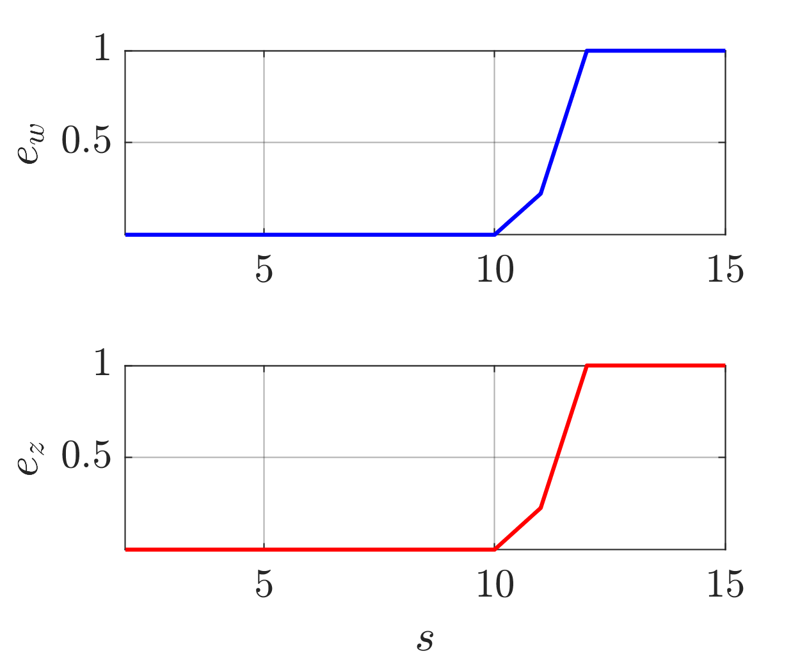
  
  <!-- 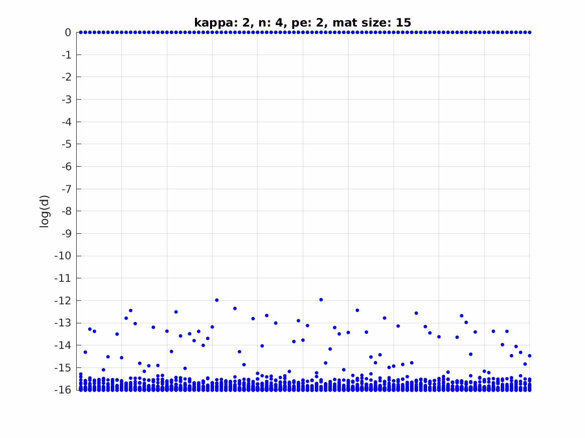 -->

### $d = 2, n = 5$

  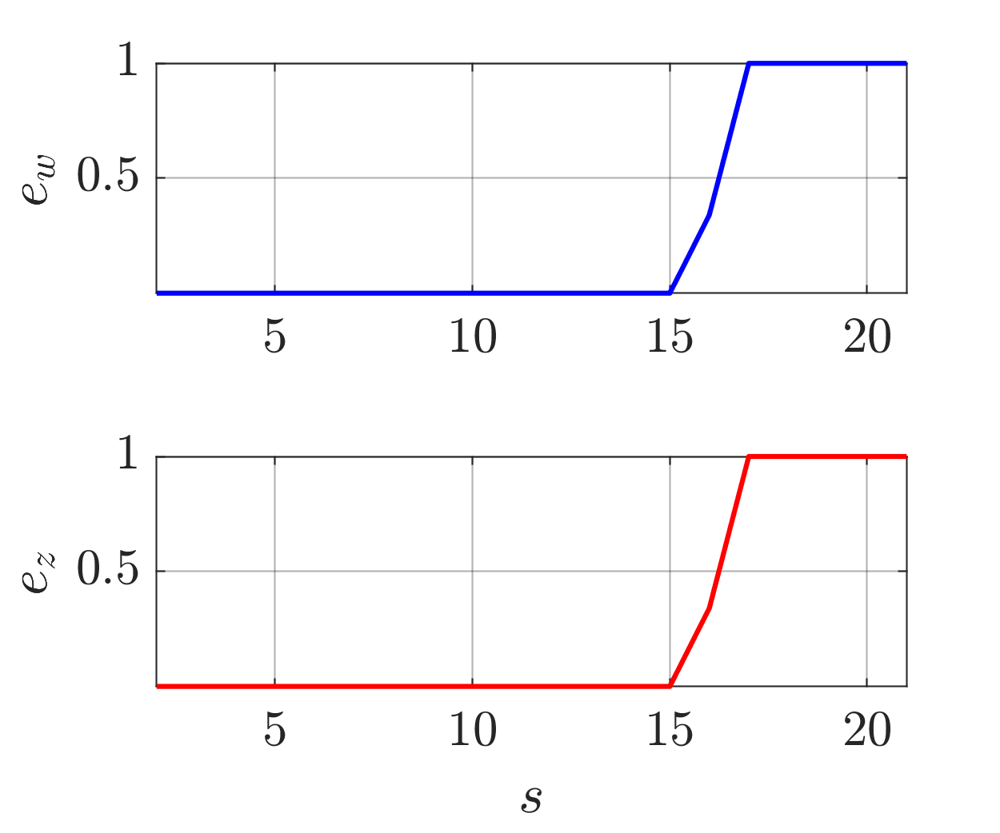
  
  <!--  -->

### $d = 2, n = 6$

  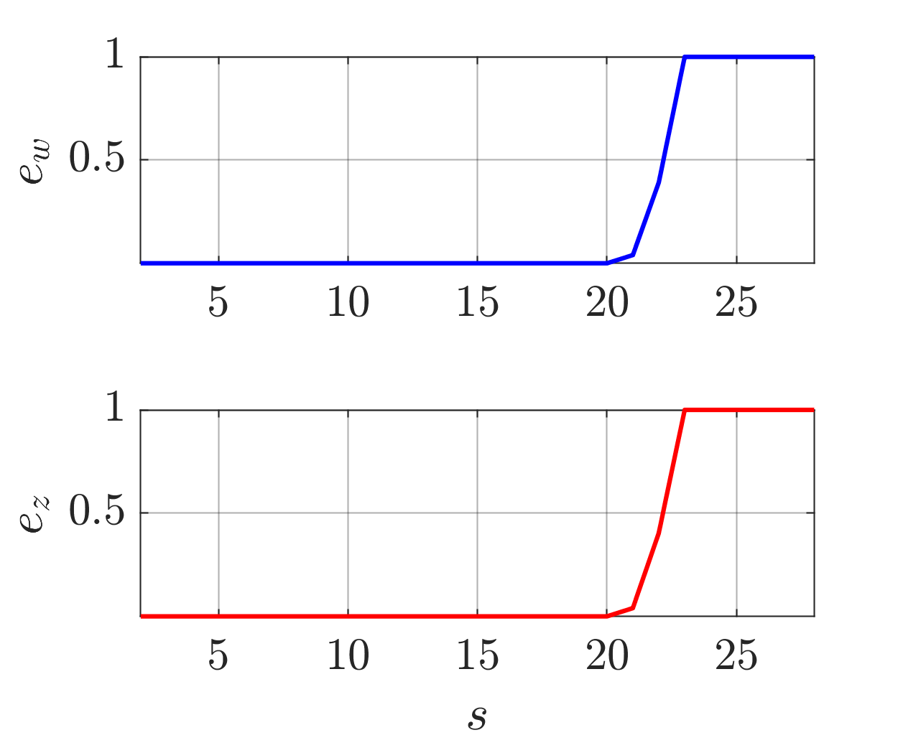
  
  <!--  -->

### $d = 2, n = 7$

  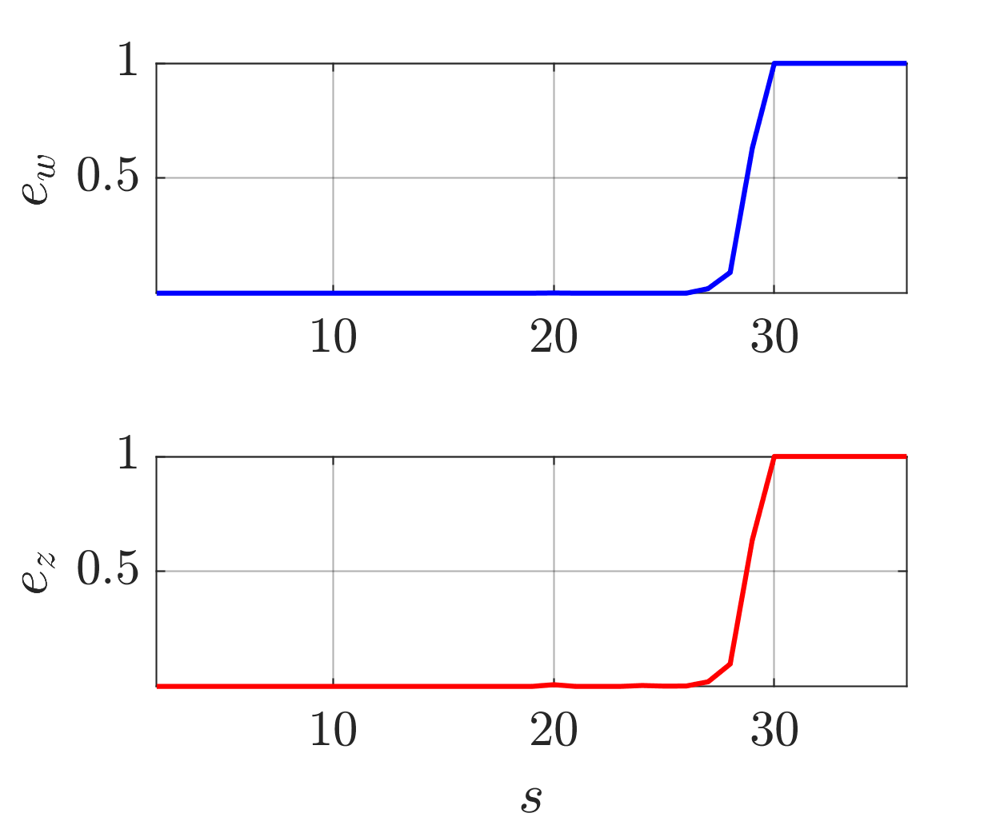
  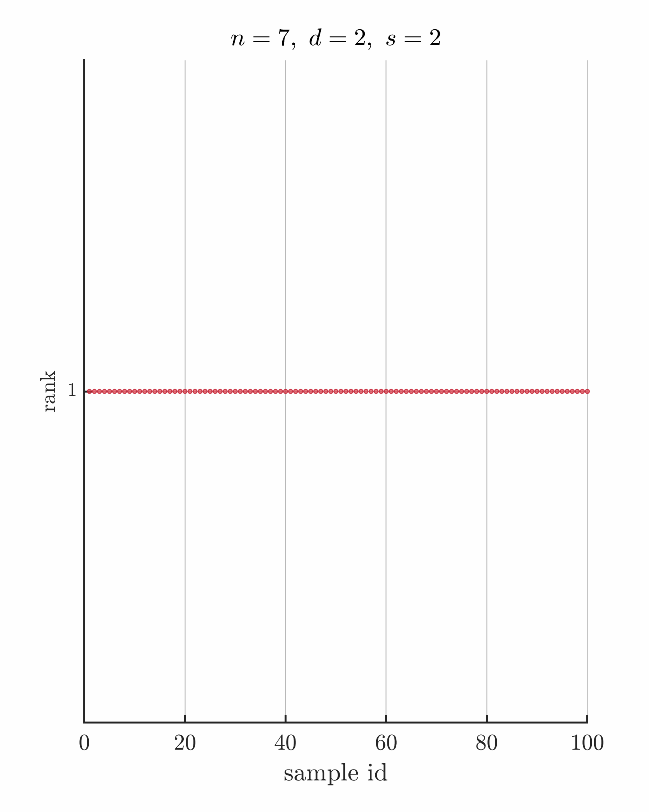
  <!--  -->

### $d = 2, n = 8$

  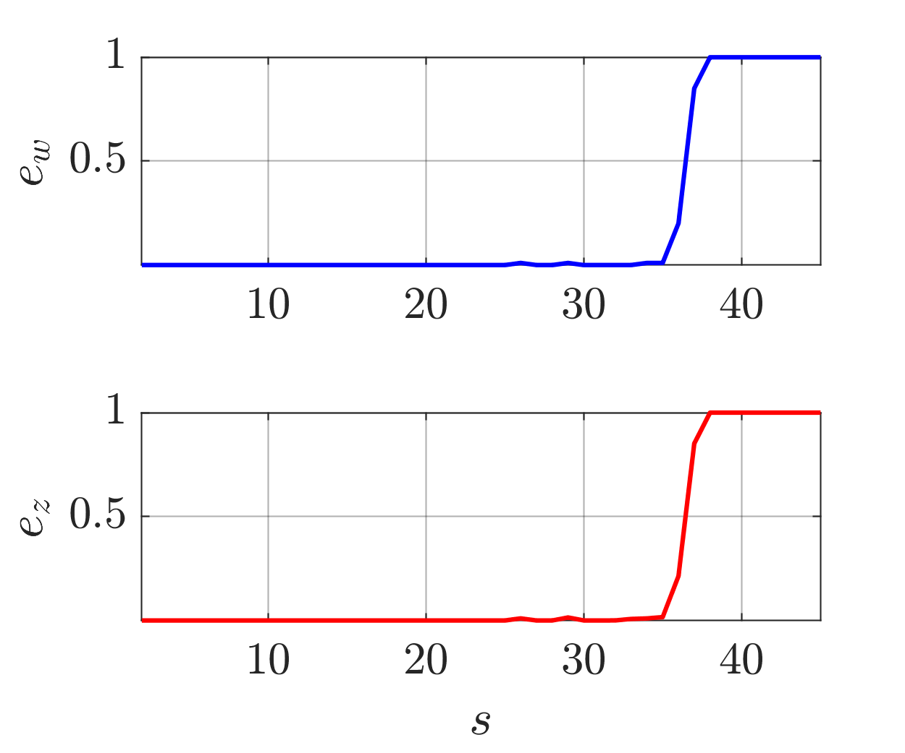
  
  <!-- 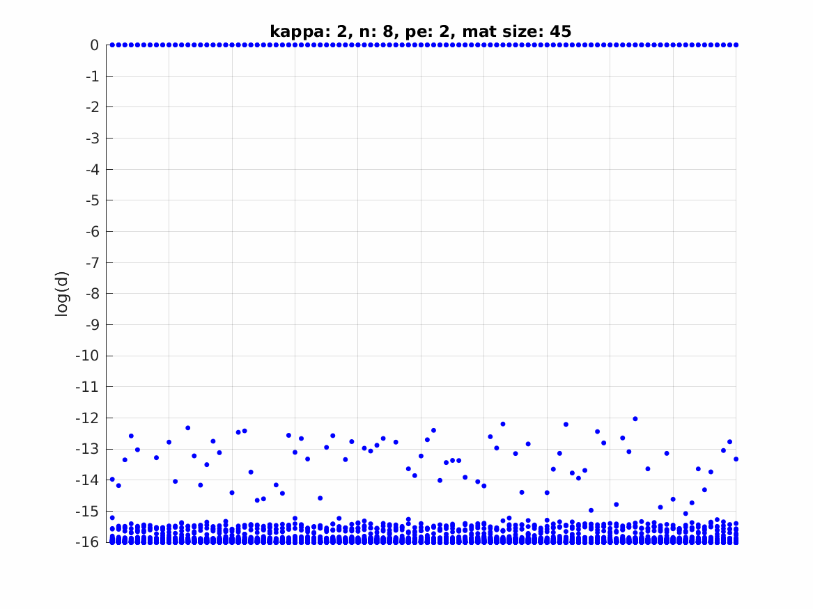 -->

### $d = 2, n = 9$

  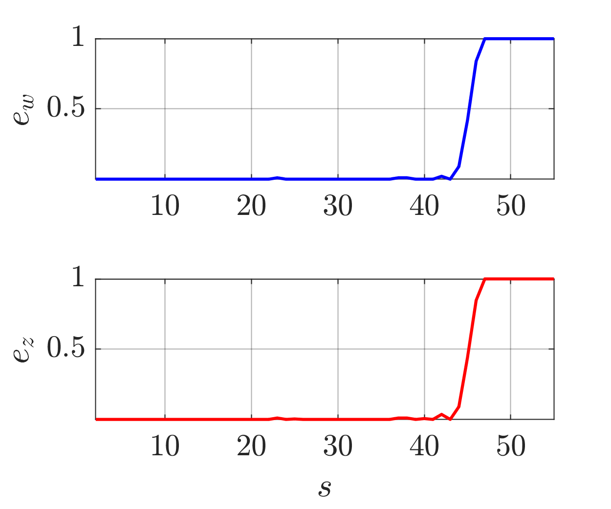
  
  <!-- 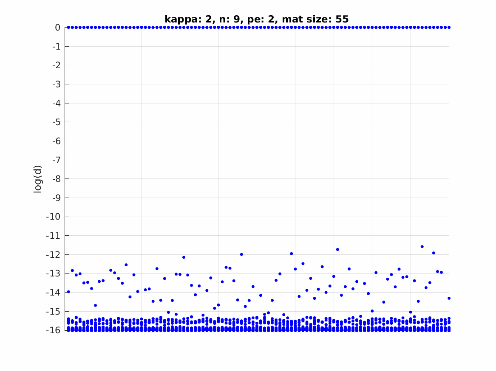 -->

### $d = 2, n = 10$

  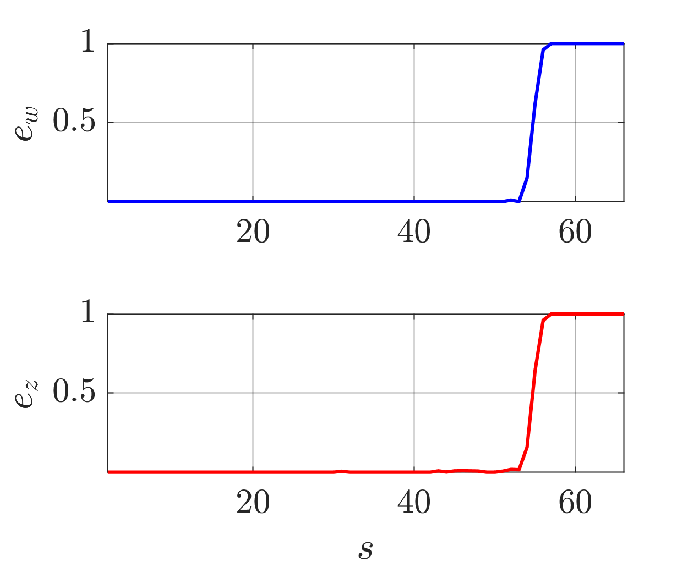
  
  <!-- 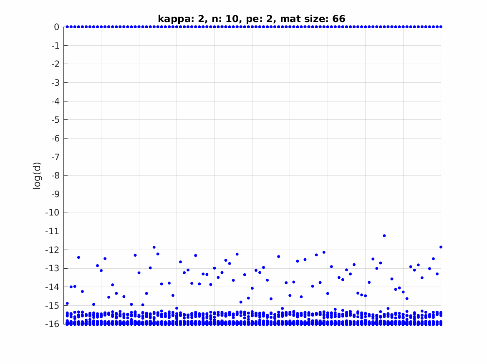 -->

